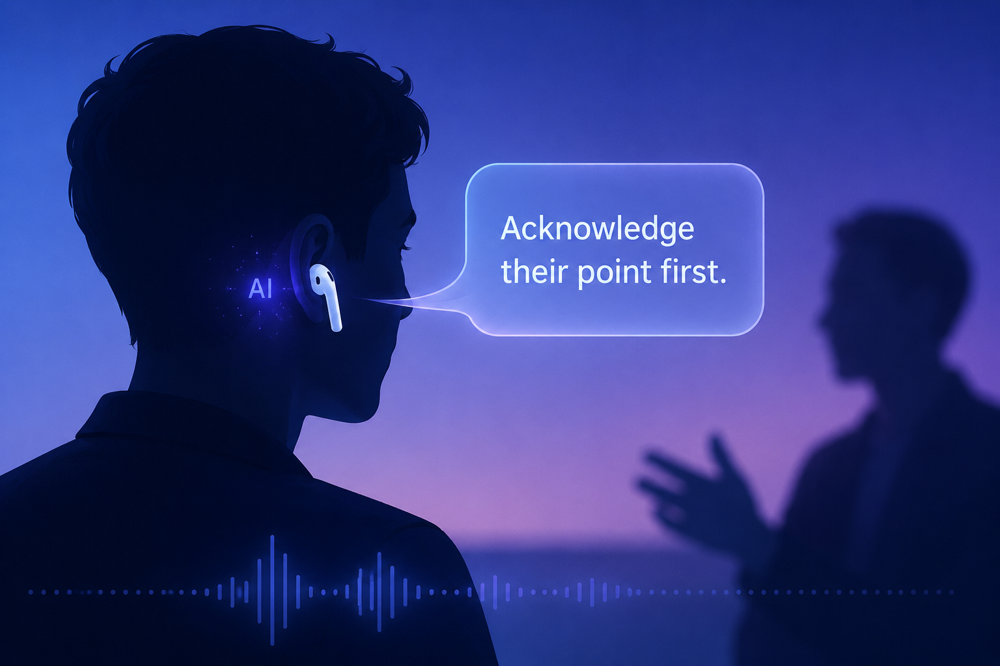

<h1 align="center">AIASIS</h1>

<p align="center">
  <em>An in-ear AI assistant that listens to live conversations and whispers coaching insights back through your AirPods.</em>
</p>

<p align="center">
  
  
  
  
  
  
</p>

<!--
TODO: A demo GIF or a short video link is the killer feature here.
Even a screenshot of the CLI in mid-session — transcript on the left,
whispered coaching suggestion on the right — would help.
Save image at docs/hero.png.
-->
<p align="center">
  
</p>

---

## The idea

In a conversation that matters — a tough customer call, a job interview, a difficult one-on-one — you often think of the right thing to say *afterwards*. AIASIS is an experiment in collapsing that gap: a Mac-first Python CLI that listens to the live conversation through your microphone, watches the transcript build, and at a moment of its choosing whispers a short coaching prompt to you through your AirPods.

This repository is a **product-validation proof of concept**, not a production system. It exists to answer: "is real-time in-ear coaching actually useful, or is the latency budget impossible?"

## How it works

Two loops running concurrently:

**Loop 1 — Listen.** Microphone capture → [Silero VAD](https://github.com/snakers4/silero-vad) for speech detection → [Deepgram](https://deepgram.com) streaming STT → rolling transcript buffer with timestamped turns.

**Loop 2 — Coach.** A timer (or a manual trigger via spacebar) takes the most recent N words of transcript, sends them to an LLM with a short coaching prompt, and plays the LLM response back through TTS to the output device (your AirPods).

```
┌─────────┐  ┌───────────┐  ┌──────────────┐  ┌──────────────────┐
│   Mic   │─▶│  Silero   │─▶│   Deepgram   │─▶│ Rolling          │
│         │  │   VAD     │  │  streaming   │  │ transcript       │
└─────────┘  └───────────┘  │     STT      │  └─────────┬────────┘
                            └──────────────┘            │
                                                        ▼
┌─────────┐  ┌───────────┐  ┌──────────────┐  ┌──────────────────┐
│ AirPods │◀─│    TTS    │◀─│   LLM call   │◀─│ Timer / manual   │
│         │  │           │  │  (OpenAI /   │  │ trigger          │
└─────────┘  └───────────┘  │   Anthropic) │  └──────────────────┘
                            └──────────────┘
```

Session logs are written to `logs/` as JSONL — every event, every whisper, every rating you give the suggestion. So a session can be replayed and a prompt can be A/B tested with real, not synthetic, conversations.

## Highlights

- 🎧 **AirPods-friendly** — input via Mac mic (better quality), output via AirPods (private playback)
- 🧠 **Multi-provider LLM** — OpenAI, Anthropic, or Azure OpenAI–compatible endpoints (`LLM_PROVIDER` env var)
- ⏱️ **Latency-aware** — Deepgram streaming + bounded prompt window keeps the round-trip under a couple of seconds
- 🎛️ **Keyboard controls** — start, stop, manual-trigger, abort, pause, and 1–5 ratings on each whisper
- 📓 **Full session logs** — every whisper is recorded with trigger type, response, duration, abort flag, prompt version, and your rating

## Requirements

- macOS
- Python 3.11+
- `ffmpeg` installed (`brew install ffmpeg`)
- A [Deepgram](https://deepgram.com) API key
- An LLM API key (OpenAI, Anthropic, or an Azure OpenAI–compatible endpoint)

## Quick start

```bash
# 1) Clone + venv
git clone https://github.com/aifriend/aiasis.git
cd aiasis
python3 -m venv .venv
source .venv/bin/activate

# 2) Install
pip install -r requirements.txt

# 3) Environment
export DEEPGRAM_API_KEY="..."
export LLM_PROVIDER="openai"       # openai | anthropic | azure
export LLM_API_KEY="..."
export LLM_MODEL="gpt-4o-mini"

# Optional (azure only)
# export LLM_BASE_URL="https://<your-resource>.openai.azure.com"
# export LLM_API_VERSION="2025-04-01-preview"

# 4) Run
python src/main.py
```

## Audio device setup

List devices first:

```bash
source .venv/bin/activate
python -m sounddevice
```

Then run with explicit indices:

```bash
python src/main.py --input-device 2 --output-device 4
```

> If AirPods mic quality is poor (it usually is), keep the **Mac built-in mic** for input and **AirPods** only for output.

## CLI options

```bash
python src/main.py \
  --input-device 2 \
  --output-device 4 \
  --prompt prompts/v1.txt \
  --interval 10 \
  --max-words 20 \
  --llm-provider openai \
  --llm-model gpt-4o-mini
```

| Flag | Default | Meaning |
|---|---|---|
| `--prompt` | latest `prompts/vN.txt` | Coaching prompt to use |
| `--interval` | (off — manual only) | Auto-trigger after N minutes of accumulated speech |
| `--max-words` | 20 (≥5 required) | Hard cap on the spoken coaching suggestion |
| `--llm-provider` | env | Override `LLM_PROVIDER` |
| `--llm-model` | env | Override `LLM_MODEL` |

## Keyboard controls

| Key | Action |
|---|---|
| `s` | Start session |
| `q` | Stop and quit |
| `space` | Manual whisper trigger |
| `x` | Abort current TTS playback |
| `p` | Pause / resume transcription |
| `1`–`5` | Rate the last whisper |

## Session logs

Each run produces `logs/session-YYYY-MM-DD-HHMMSS.jsonl`. One JSON object per line. Includes:

- Event markers (manual trigger, pause/resume, playback start/end)
- Whisper entries — trigger type, LLM response, duration, rating, abort flag, prompt version
- Session summary — start/end, average rating, abort count, total duration

These logs are the substrate for prompt iteration. Compare ratings across prompt versions to see which framing actually helps in the moment.

## Security & privacy

- API keys are read from environment variables; `python-dotenv` is supported but `.env` should never be committed
- **Transcripts contain sensitive conversation content.** Treat the `logs/` directory as confidential
- Never hardcode secrets in source files
- AIASIS is a PoC — there is no built-in encryption-at-rest or remote backup; that's deliberate

## Project structure

```
.
├── src/
│   ├── main.py             # Entry point + keyboard loop
│   ├── audio_in.py         # Mic capture + VAD
│   ├── stt.py              # Deepgram streaming client
│   ├── transcript.py       # Rolling buffer + window selection
│   ├── llm.py              # Multi-provider LLM wrapper
│   ├── tts.py              # Text-to-speech playback
│   └── logger.py           # JSONL session logger
├── prompts/                # Versioned coaching prompts (v1.txt, v2.txt, ...)
├── docs/
│   └── aiasis-poc.md       # Product / validation plan
└── logs/                   # Session logs (gitignored)
```

## Roadmap

- [ ] Stream LLM tokens straight to TTS so playback starts before generation finishes (lower perceived latency)
- [ ] Local Whisper option as a STT fallback
- [ ] Multi-speaker diarization (so coaching can be aware of "they just said X")
- [ ] A small browser UI for reviewing past sessions and ratings
- [ ] Prompt-A/B harness — randomly alternate between two prompts mid-session, compare ratings

## Why this project exists

I want to know if **in-ear AI coaching** during live conversations is a real product category or a curiosity. AIASIS is the cheapest end-to-end implementation I could build that surfaces the real constraints — latency, false-positive triggers, whisper quality, and whether the suggestion is ever genuinely useful in the moment. If it isn't, that's a finding worth having quickly.

## License

MIT — see [LICENSE](LICENSE).

## Author

**Jose Lopez** — AI engineer in Madrid, working on the intersection of biological and artificial intelligence.

- GitHub: [@aifriend](https://github.com/aifriend)
- LinkedIn: [jafdl](https://www.linkedin.com/in/jafdl)
- Website: [auto-latam.com](https://auto-latam.com/en)
